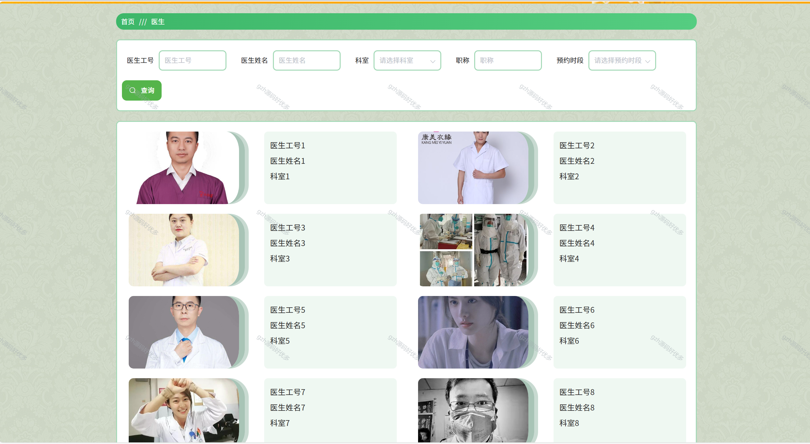
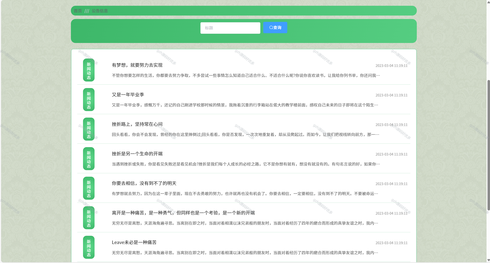
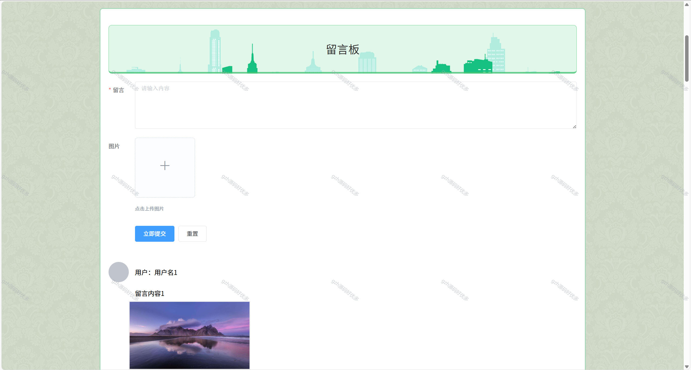
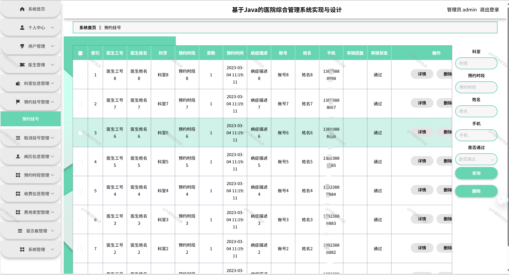
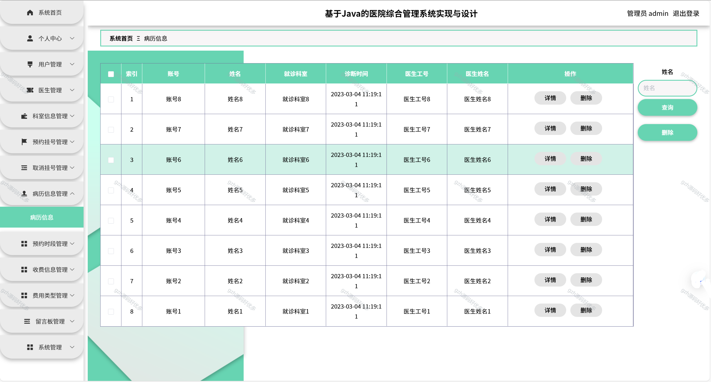
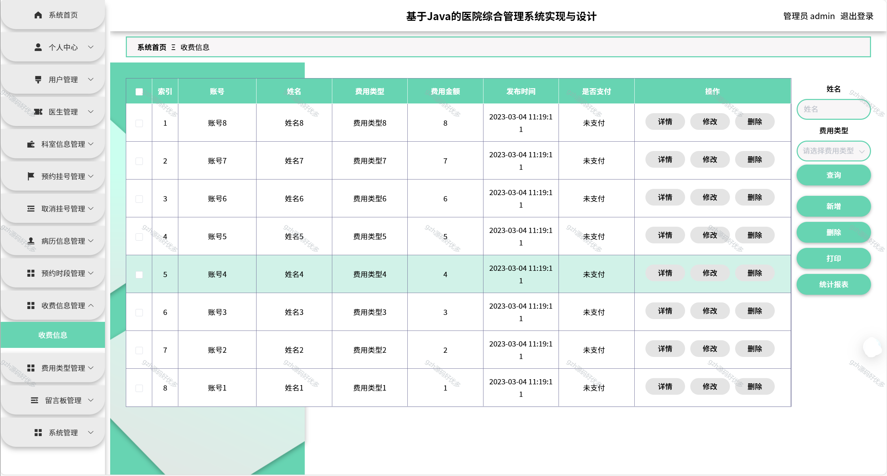
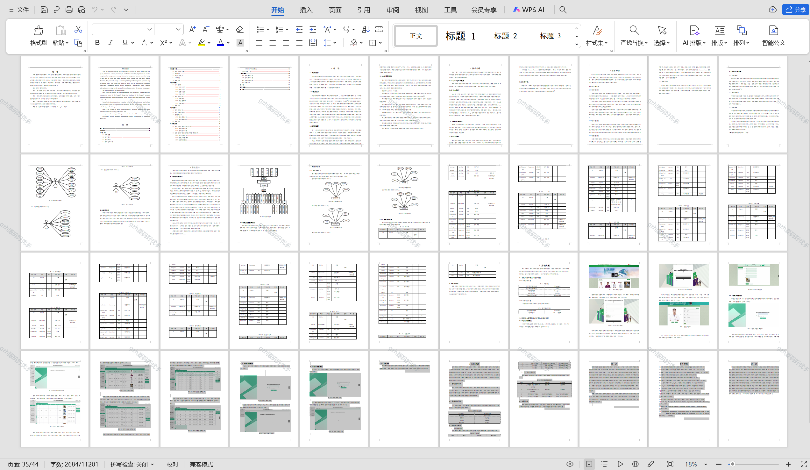

# springbootA290
springbootA290医院综合管理系统
 
## 查看主页获取源码

### 一、关键词
医院综合业务管理系统，医院一体化管理系统，医院集成管理系统

### 二、作品包含
源码+数据库+设计文档万字+PPT+全套环境和工具资源+本地部署教程

### 三、项目技术
前端技术：Html、Css、Js、Vue2.0、Element-ui 
后端技术：Java、SpringBoot2.0、MyBatis

### 四、运行环境（以下版本亲测，其他版本兼容性请自行测试）
开发工具：IDEA/eclipse  + VSCODE

数据库：MySQL5.7（最低要5.7版本）

数据库管理工具：Navicat10以上版本

环境配置软件： JDK1.8 + Maven3.6.3

前端Nodejs：14

浏览器：谷歌浏览器

### 五、项目介绍
项目编号：springbootA290

设计一套医院综合管理系统，帮助医院进行预约挂号、取消挂号、病历信息、预约时段、收费信息等繁琐又重复的工作，提高工作效率的同时，也减轻了管理者的压力。
第一，研究分析当下主流的web技术，结合医院日常管理方式，进行医院综合管理系统的数据库设计，设计医院综合管理系统功能，并对每个模块进行说明。
第二，陈列说明该系统实现所采用的架构、系统搭建采用的服务器、系统开发环境和使用的工具，以及系统后台采用的数据库。
最后，对系统进行全面测试，主要包括功能测试、查询性能测试、安全性能测试。
分析系统存在的不足以及将来改进的方向。

### 六、运行截图

